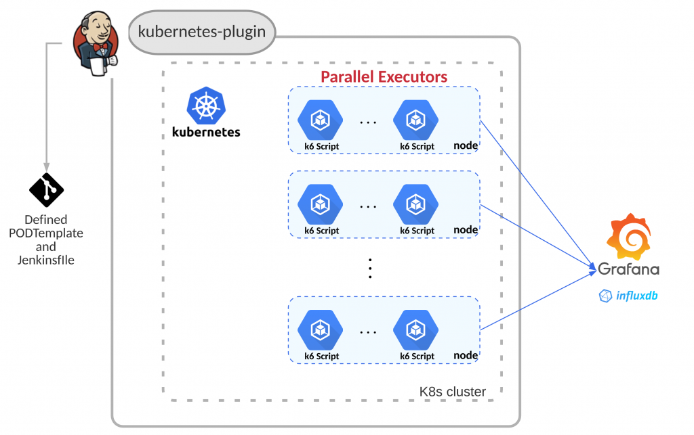

# Performance Test in Jenkins – Run Dynamic Pod Executors in Kubernetes Parallelly

Performance tests are a necessary and crucial part of all services in LINE, which ensures that software applications will perform well under the expected workload. Whenever features which may affect overall user experience are implemented, performance testing is executed as a part of the testing plan.

But setting up and maintaining a performance test environment is not always easy and efficient, reasons are listed as below:

* Server load criteria varies between features, component, and events

    * According to different performance criteria of features implemented on different components or sometimes event scales, the RPS (request per second) varies a lot. And most open source performance tools do not have features to control multiple test executors and help you to consolidate reports from each of them. Thus testers needs to perform steps manually and multiple try runs to find out the right scale machine to run the performance test scripts. These steps require allocating  new machines, installing necessary libraries, uploading scripts, and doing some try runs to make sure scripts can generate necessary workloads without over exhausting the test machine itself.

* Each service or team maintains its own performance test environment

    * Due to the reasons such as workload criteria and release schedule, each team or service here in Taiwan maintain their own set of performance test environments, which includes some workload machines, an Influx DB, and Grafana dashboard machines. These servers are quite identical in functionalities but the setting up and maintaining a set of these servers by each team is very cumbersome and not very good for the developer experience.

* Machine utilization is very low

    * Large scale performance tests like these are not required to be executed frequently and most of the time are considered when new features are implemented or there are changes to architecture. Each team having their own set of servers allocated for these infrequent workloads makes server utilization very low, but still it requires maintenance resources from time to time.

* Lack of a centralized monitoring dashboard

    * Performance tests require monitoring test executor resources and server sides resources all together at the same time. In the past, an engineer would open multiple terminal consoles in a desktop window and issues commands to monitor CPU, memory, disk, and network IO from there. These are not convenient to setup nor easy to preserve records from test executions.

So, in the following sections, we are going to show you how to leverage dynamic resource management from the Jenkins Kubernetes plugin to solve the problems highlighted above.

In LINE Taiwan, most of the time we use k6 as our load testing tool, so the setup below is based on this scenario, but should be the same for other tools as well.

## Architecture diagram

The idea here is to prepare a platform that uses the Kubernetes plugin for Jenkins which allows each team to run their performance (k6) test scripts without worrying about underlying infrastructure setup and maintenance.

The platform can evenly distribute workloads across all available nodes in the cluster to better simulate real-world scenarios without stressing computing resources and network bandwidth on a single machine. 

For each team that wants to use the platform, the following attributes are provided as necessary:

1. POD_COUNT: How many Pods do you want to run your workload?
2. GIT_RAW_FILE: Your k6 performance script in raw format in your version control server
3. DURATION and VIRTUAL_USER: Check the definition of duration and VUs in the official k6 documentation
4. INFLUX_DB: The URL to your InfluxDB where load testing data is hosted (better to set up one server for all teams)

## Performance test platform resources

Git repository resources

To make this work, we need to prepare a Jenkins pipeline (jenkinsfile) and a PodTemplate to instruct Kubernetes plugin for Jenkins to provision the workload resources.

Verification

We can check this from k9s (Kubernetes management console) to see how workloads are provisioned, and we can see that Pods are evenly distributed across all available nodes as seen in the screenshot below.

You can verify each pod is running the k6 script by attaching into the shell of the k6 container and checking the standard output.

## Links

1. [Performance Test in Jenkins – Run Dynamic Pod Executors in Kubernetes Parallelly] (https://engineering.linecorp.com/en/blog/performance-test-in-jenkins-run-dynamic-pod-executors-in-kubernetes-parallelly/)

2. [k6 Prometheus Exporter] (https://github.com/benc-uk/k6-prometheus-exporter)
3. https://github.com/grafana/xk6-output-prometheus-remote

4. How to run sidecar container in jenkins pipeline running inside kubernetes https://stackoverflow.com/questions/54589786/how-to-run-sidecar-container-in-jenkins-pipeline-running-inside-kubernetes

5. Jenkinsfile Pipeline: reach ip of sidecar of host

6. Build your Go image https://docs.docker.com/language/golang/build-images/

7. How To Deploy a Go Web Application with Docker. https://semaphoreci.com/community/tutorials/how-to-deploy-a-go-web-application-with-docker

8. Complete Guide to Create Docker Container for Your Golang Application https://levelup.gitconnected.com/complete-guide-to-create-docker-container-for-your-golang-application-80f3fb59a15e

9. Dynamic Jenkins Agent from Kubernetes https://itnext.io/dynamic-jenkins-agent-from-kubernetes-4adb98901906
10. How to Setup Jenkins Build Agents on Kubernetes Pods https://devopscube.com/jenkins-build-agents-kubernetes/

docker build -t vieskov1980/k6pm .
Sending build context to Docker daemon  1.003MB
Step 1/13 : FROM golang:1.17-alpine as builder
 ---> e8fc0c5ad389
Step 2/13 : WORKDIR $GOPATH/src/go.k6.io/k6
 ---> Using cache
 ---> bc4d5b99e9b2
Step 3/13 : ADD . .
 ---> 4fd46af7e171
Step 4/13 : RUN apk --no-cache add git
 ---> Running in 893b00efe62f
fetch https://dl-cdn.alpinelinux.org/alpine/v3.15/main/x86_64/APKINDEX.tar.gz
fetch https://dl-cdn.alpinelinux.org/alpine/v3.15/community/x86_64/APKINDEX.tar.gz
(1/6) Installing brotli-libs (1.0.9-r5)
(2/6) Installing nghttp2-libs (1.46.0-r0)
(3/6) Installing libcurl (7.80.0-r0)
(4/6) Installing expat (2.4.1-r0)
(5/6) Installing pcre2 (10.39-r0)
(6/6) Installing git (2.34.1-r0)
Executing busybox-1.34.1-r3.trigger
OK: 19 MiB in 21 packages
Removing intermediate container 893b00efe62f
 ---> a5bca789301e
Step 5/13 : RUN CGO_ENABLED=0 go install -a -trimpath -ldflags "-s -w -X go.k6.io/k6/lib/consts.VersionDetails=$(date -u +"%FT%T%z")/$(git describe --always --long --dirty)"
 ---> Running in 06b8fc7d74cb
go: cannot find main module, but found .git/config in /go/src/go.k6.io/k6
	to create a module there, run:
	go mod init
The command '/bin/sh -c CGO_ENABLED=0 go install -a -trimpath -ldflags "-s -w -X go.k6.io/k6/lib/consts.VersionDetails=$(date -u +"%FT%T%z")/$(git describe --always --long --dirty)"' returned a non-zero code: 1

kubectl exec -it pod-name -- /bin/bash -c " command(s) "

https://www.elastic.co/guide/en/beats/metricbeat/current/configuration-dashboards.html

https://blog.pilosus.org/posts/2019/05/24/k8s-volumes-list-copy/